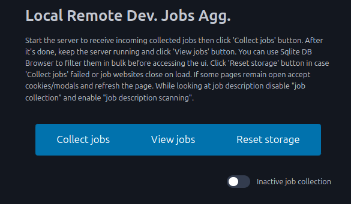

# Local Remote Developer Jobs Aggregator

Easily keep track the jobs you've applied in one place. 
No more questions like: "Did I applied to this job before? Hmm... looks familiar". 
If you know a bit of javascript - clone repo and modify it with your prefered job boards and jobs types.

## Quickstart

- (One-time task) clone this repo;
- (One-time task) [install bunjs](https://bun.sh/docs/installation);
- (One-time task) load extension in browser (`edge://extensions/` or `chrome://extensions/` then `Load unpacked` point to `chrome-extension` folder). Hit reload extension if you make some mofifications on the extension code;
- (One-time task) open each website from `service-wrker.js` accept pop-ups/cookies/make account;
- (One-time task) checkout `ignorekeywords.txt` and add your own keywords;
- (One-time task) run `bun install`;
- run `bun server.ts`;
- click `Collect jobs` button (let it do it's thing);
- after it's done, keep the server running and click `View jobs` button (TIP: install [DB Browser](https://sqlitebrowser.org/) and perform operations in bulk);
- When it arrives to LinkedIn scrapping you have to manually switch between tabs to not lose focus;

You can checkout the remote job boards scrapped in the `chrome-extension/service-wrker.js` the `JOB_BOARDS` const. Add/remove/modify it for your needs. Make sure for each new website you add to create a scrape function in `chrome-extension/content-script.js`  

The extension:

The interface:

## How it works?

When you click on the extension button `Collect jobs` a chrome runtime event `startScrapping` is sent to the `service-worker.js` which opens in a new tab a job board url. 
Once the url is loaded in a new window `content-script.js` will be invoked and the page will be scrapped based on the `hostMapper` object. Data scrapped is sent to the server (built with [HonoJs](https://hono.dev/)) and saved into a sqlite database.
The `content-script.js` once is finished scrapping and sending the data will also emit a chrome runtime event `closeTab` to `service-worker.js` which will close the tab opened.
If something goes wrong an alert popup will be invoked on the website with the issue and if posible the error will be sent and saved on the server. Click 'Reset storage' button in case 'Collect jobs' failed or job websites close on load.

**Note:** 
After scrapping is finised deactivate `job collection`. 

## Why a chrome extension and not pupeteer, playwright, selenium?

I tried doing that, but the amount of dependencies just to get it working is absurd (in ubuntu a ton of lib* files were needed).
Some websites have heavy protection for bots, scrappers which complicates even further the setup and code.
With the chrome extension you can bypass a lot of those and just act "like a user" on the website.
No cookies to accept, login session and so on because it uses the session already available in the browser.

**😁 Good luck job hunting!**

<!-- 

This is The Mother of All VC Lists

The first step of a successful fundraising process is a large list of investors that invest in your stage and segment. Here are some lists to get started 👇 

💰𝗩𝗖𝘀 𝗯𝘆 𝗦𝘁𝗮𝗴𝗲:
⬪ Pre-Seed: https://lnkd.in/gnxYgFF8
⬪ Seed: https://lnkd.in/g7rntFQa
⬪ Seed & Series A: https://lnkd.in/gU_PZwra
⬪ Below 200 Million: https://lnkd.in/g4QhNsjV

𝗩𝗖𝘀 𝗯𝘆 𝗟𝗼𝗰𝗮𝘁𝗶𝗼𝗻:
⬪ US VCs: https://lnkd.in/gDcKfxwD
⬪ NYC VCs: https://lnkd.in/gMKTstBz
⬪ European VCs: https://lnkd.in/gZC4qqxW
⬪ UK VCs: https://lnkd.in/gkPYUKH3
⬪ French VCs: https://lnkd.in/g2bHpUYd
⬪ Spanish VCs: https://lnkd.in/gBD_7rRY
⬪ Baltic VCs: https://lnkd.in/gx2iHdDS
⬪ Australian VCs: https://lnkd.in/gbFnpmRX
⬪ Indian VCs: https://lnkd.in/durcuiUw
⬪ Singapore VCs: https://mapofthemoney.com/

𝗩𝗖𝘀 𝗯𝘆 𝗜𝗻𝗱𝘂𝘀𝘁𝗿𝘆:
⬪ Climate VCs: https://lnkd.in/d__3NqRC
⬪ Deep Tech VCs: https://lnkd.in/gqTqjKJu
⬪ HealthTech VCs: https://lnkd.in/gMWDprYC
⬪ Consumer VCs: https://lnkd.in/ganPEBgV
⬪ FinTech VCs: https://lnkd.in/gWFADRuP

😇 𝗔𝗻𝗴𝗲𝗹𝘀:
⬪ US Founders Investing: https://lnkd.in/gHtZZY2y
⬪ SaaS Angels: https://lnkd.in/g3z9sBAE
⬪ US Women: https://lnkd.in/gd4JefpG
⬪ Global Women: https://lnkd.in/gYAW3avh
⬪ Australia: https://lnkd.in/gxYmwaTb
⬪ Africa: https://lnkd.in/g3z-cx6z
⬪ Middle East: https://lnkd.in/ghZ5PeQF

🌱 𝗔𝗰𝗰𝗲𝗹𝗲𝗿𝗮𝘁𝗼𝗿𝘀:
⬪ Every Accelerator: https://lnkd.in/dncseAmE

 -->