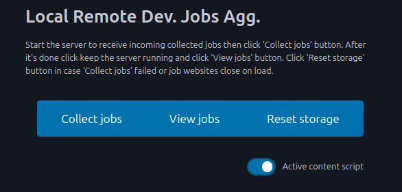
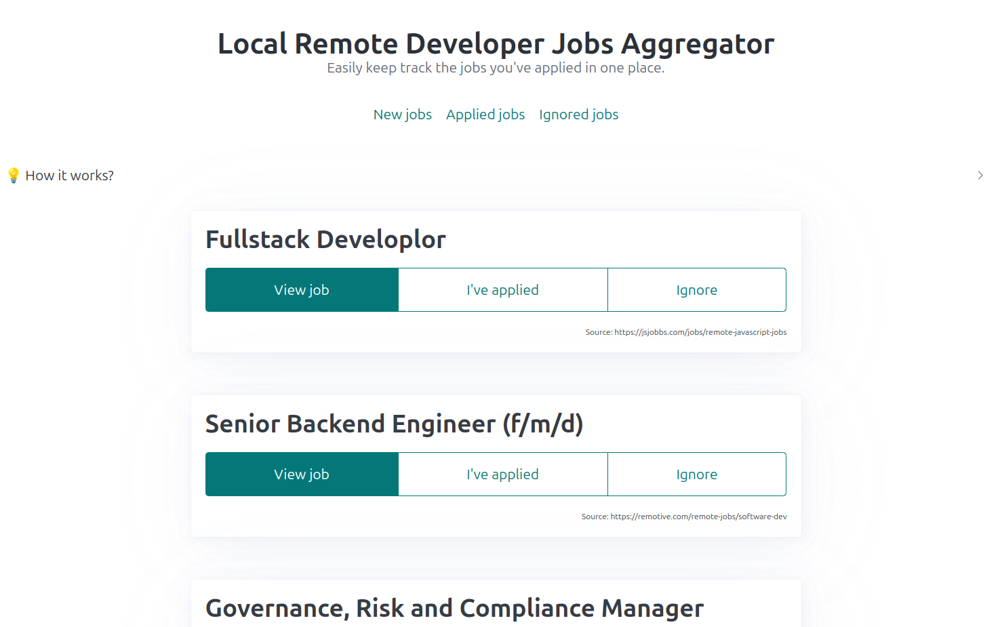

# Local Remote Developer Jobs Aggregator

Easily keep track the jobs you've applied in one place. 
Fork it and modify it with your own prefered job boards.

## Quickstart

- clone this repo;
- [install bunjs](https://bun.sh/docs/installation);
- load extension in browser (`edge://extensions/` or `chrome://extensions/` then `Load unpacked` point to `chrome-extension` folder);
- run `bun server.ts`;
- click `Open job boards` button (let it do it's thing);
- after it's done, keep the server running and click `View collected jobs` button;

You can checkout the remote job boards scrapped in the chrome-extension/manifest.json file `content_scripts.matches` and in the `service-worker.js` in `JOB_BOARDS` constant.

The extension:

The interface:

## How it works?

When you click on the extension button `Open job boards` a chrome runtime event `startScrapping` is sent to the `service-worker.js` which opens in a new window a job board url. 
Once the url is loaded in a new window `content-script.js` will be invoked and the page will be scrapped based on the `mapper` object. Data scrapped is sent to the server (built with [HonoJs](https://hono.dev/)) and saved into a sqlite database.
The `content-script.js` once is finished scrapping and sending the data will also emit a chrome runtime event `closeTab` to `service-worker.js` which will close the window/tab opened.
If something goes wrong an alert popup will be invoked on the website with the issue and if posible the error will be sent and saved on the server.

## Why a chrome extension and not pupeteer, playwright, selenium?

I tried doing that, but the amount of dependencies just to get it working is absurd (in ubuntu a ton of lib* files were needed).
Some websites have heavy protection for bots, scrappers which complicates even further the setup and code.
With the chrome extension you can bypass a lot of those and just act "like a user" on the website.
No cookies to accept, login session and so on because it uses the session already available in the browser.

**Scrapping is slowish** because if opening all the 70 or so job boards at once will break the server and the browser will not load all the websites in order to save some resources - resulting in the content-script.js to not run.

**😁 Good luck job hunting!**
